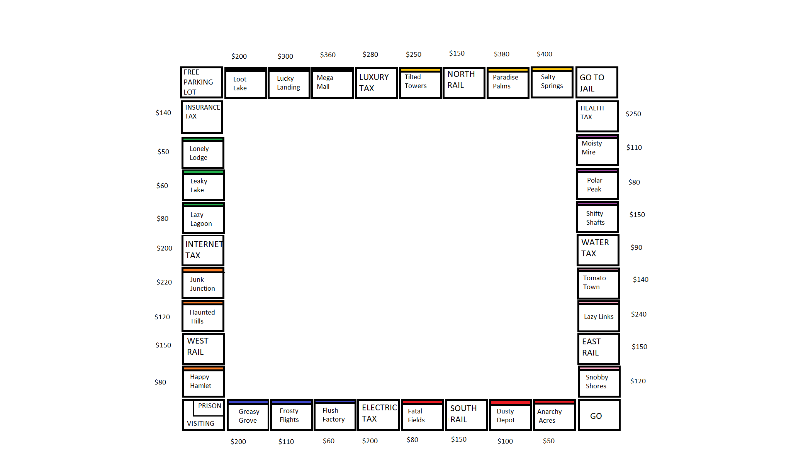

# Monopoly Game
```
SYSC 3110 | Software Designing Project (SDK 17 working)
```
# Game.Board
<div align-item="center"></div>

# Description:
The Monopoly Game is implemented following the <strong>MVC</strong> pattern and written in <strong>Java</strong>
<br>
Monopoly is a multiplayer economics-themed board game. In the game, players roll two dice to move around the game board, buying and selling properties, and developing them with houses and hotels. Players collect rent from their opponents, with the goal being to drive them into bankruptcy. Players receive a stipend every time they pass "Go", and can end up in jail, from which they cannot move until 3 turns have passed.

# Files required to run this program:
* DiceImg package
* Game.Bank.java,
* Game.BankProperty.java,
* Game.Board.java,
* Game.Business.java,
* ColorGroup.java,
* Game.Dice.java,
* Game.MonopolyController.java,
* Game.MonopolyGUIView.java,
* Tests.MonopolyControllerViewTest.java,
* MonopolyView.java,
* Game.Player.java,
* PrivatePropertyListModel.java,
* Game.PrivateProperty.java,
* Game.PropertyAPI.java,
* Game.Rail.java,
* Game.RoleAPI.java,
* Game.SellPlayerPropertyDialog.java,
* Game.Square.java

# Usage:
```
Run the main method inside the MonopolyView.java file and follow the textual instruction.
```

# Contributors:
* Ngo Huu Gia Bao:                       huugiabaongo@cmail.carleton.ca,       
* Gabriel Benni Kelley Evensen:          bennievensen@cmail.carleton.ca,
* Zakaria Ismail:                        zakariaismail@cmail.carleton.ca,               
* Yuguo Liu:                             patrickliu@cmail.carleton.ca,

# Roadmap:
* Milestone 1:
An UI allows to play the Monopoly Game
  
* Milestone 2:
Be able to run the game in a graphical user interface

* Milestone 3:
Add additional features such as having the ability to buy houses and hotel on private properties square
Have the ability to add “AI” players into the game

* Milestone 4:
Be able to save/load game progresses,
Have an international version of the game in which players can have customized property names, values and currencies


# Changes From Previous Milestone

The game can now be ran in a graphical user interface instead of being purely textual

Added files:
* DiceImg package:
  Contains pictures used for displaying dice faces
* Game.MonopolyGUIView.java:
  Class that is responsible for the overall appearance of the GUI 
* Tests.MonopolyControllerViewTest.java:
  Contains various testing cases for methods in Game.MonopolyController.java
* PrivatePropertyListModel.java:
  Used by class Game.SellPlayerPropertyDialog.java
* Game.SellPlayerPropertyDialog.java:
  Class that is responsible for displaying a dialog box and process requests when the players wish to sell them owned properties
  
# Known Issue

* Game.Player label is updated whenever the player rolls the dice, however, if a player landed on a square that is already occupied, the previous player's label will be erased. This is only a visual issue and does not have any impact on the player's actual position in the system.

* When the prompt asks the player to enter an integer, entering an out of bound integer, a letter or any other symbols will cause the program to crash. Try Catch statements will be implemented later.
* If a player does not own any properties, entering invalid property index will cause the program to crash
* If programme is not in fullscreen then board may glitch

