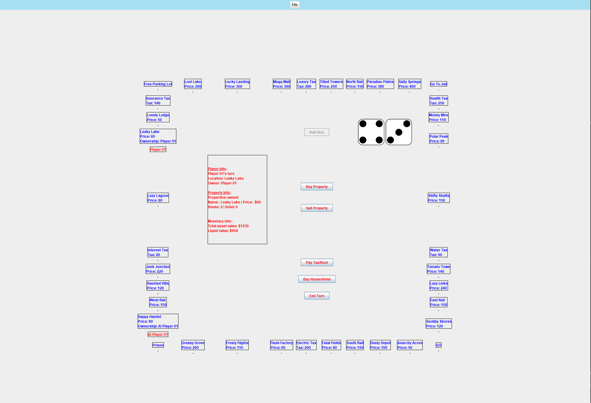

# Monopoly Game

```
SYSC 3110 | Software Designing Project (SDK 17 working)
```

# GUI

<div align-item="center"></div>

# Description:

The Monopoly Game is implemented following the <strong>MVC</strong> pattern and written in <strong>Java</strong>
<br>
Monopoly is a multiplayer economics-themed board game. In the game, players roll two dice to move around the game board, buying and selling properties, and developing them with houses and hotels. Players collect rent from their opponents, with the goal being to drive them into bankruptcy. Players receive a stipend every time they pass "Go", and can end up in jail, from which they cannot move until 3 turns have passed.

The Game have more functionality such as customize the name of the Square, it can also be saved or load by the user with the XML format

# Files required to run this program:

-   DiceImg package

-   Game.Bank.java,
-   Game.BankProperty.java
-   Game.Board.java
-   Game.Business.java
-   Game.BuyHouseHotelDialog.java
-   Game.Dice.java
-   Game.MonopolyController.java
-   Game.MonopolyGUIView.java
-   Game.MonopolyModel.java
-   Game.Player.java
-   PrivatePropertyListHouseModel.java

-   Bank.java
-   BankProperty.java
-   Board.java
-   Business.java
-   ColorGroup.java
-   Dice.java
-   MonopolyController.java
-   MonopolyGUIView.java
-   MonopolyTest.java
-   MonopolyView.java
-   Player.java
    
-   PrivatePropertyListModel.java
-   PrivateProperty.java
-   PropertyAPI.java
-   Rail.java
-   RoleAPI.java
-   SellPlayerPropertyDialog.java
-   Square.java

# Installation:
```
The program is running locally, the user need to download the .jar file or follow the usage step
```

# Usage:

```
Open the IDE and run the main method inside the MonopolyGUIView.java file and follow the user interface
```

# Contributors:

-   Ngo Huu Gia Bao: huugiabaongo@cmail.carleton.ca,
-   Gabriel Benni Kelley Evensen: bennievensen@cmail.carleton.ca,
-   Zakaria Ismail: zakariaismail@cmail.carleton.ca,
-   Yuguo Liu: patrickliu@cmail.carleton.ca,

# Roadmap:

-   Milestone 1:
    An UI allows to play the Monopoly Game
-   Milestone 2:
    Be able to run the game in a graphical user interface

-   Milestone 3:
    Add additional features such as having the ability to buy houses and hotel on private properties square
    Have the ability to add “AI” players into the game

-   Milestone 4:
    Be able to save/load game progresses to XML file,
    Have an international version of the game in which players can have customized property names

# Changes From Previous Milestone

The players can now have an international version of the game by importing an XML file which alters the name and prices of the squares
The players are now able to save, load game progresses or customize the name of the Square

Added files:

-   PlayerPropertyListModel.java and Buy House Hotel Dialog.java classes: Handle the buying houses and hotel functionality
-   RentableAPI.java: The interface class for Business.java and Rail.java
-   Refactor the code to the MVC pattern, the MonopolyModel is the main model class. The MonopolyController.java implements ActionListener
-   AIPlayer.java: Responsible for the AI player. The AI player will automatically roll the dice, buy property(if possible), pay tax/ rent
    and end their turn.

# Known Issue

-   Player label is updated whenever the player rolls the dice, however, if a player landed on a square
    that is already occupied, the previous player's label will be erased. This is only a visual issue and
    does not have any impact on the player's actual position in the system.
-   When the prompt asks the player to enter an integer, entering an out of bound integer, a letter or any other symbols will cause the program to crash.
    Try Catch statements will be implemented later.
-   If a player does not own any properties, entering invalid property index will cause the program to crash

-   If programme is not in fullscreen then board may glitch
